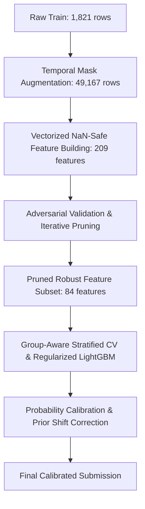

# Revised Challenge Context & Modeling Strategy

This document details the updates made to the Aquaculture Pond Detection project following the organizers' revised challenge setup.

---

## 1. The Revised Challenge Setup

### Data Changes
* **No Coordinates**: `latitude` and `longitude` metadata columns have been completely removed.
* **Dataset Rescale**:
  * **Train Set**: Expanded to **1,821 samples** (contains the original training set + the original test set with labels).
  * **Test Set**: **1,030 samples** (completely new data).
* **Temporal Masking**: Test samples are masked to simulate a real-world partial-observation setting. Each test sample only includes a consecutive block of **4, 5, or 6 months** of observations; the remaining months are set to `-9999` across all 12 bands.

---

## 2. Our Modeling Approach

To address coordinate removal and temporal missingness, we implemented a robust pipeline structured as follows:

### 2.1 NaN-Safe Feature Engineering
* All raw `-9999` masks are replaced with `NaN` at load time.
* Temporal aggregations (means, medians, standard deviations, percentiles) are calculated row-wise ignoring `NaN` values.
* Added window metadata features: `window_start`, `window_length`, `window_center`, and circular calendar encodings (sine and cosine of start and center months).
* All occurrence counts (like months meeting water thresholds) are normalized as fractions of observed months.

### 2.2 Temporal Mask Augmentation
* To prevent distribution shifts on statistical aggregations between 12-month training profiles and 4–6 month test profiles, the 1,821 training profiles were expanded to **49,167 samples** by simulating all 27 possible consecutive 4, 5, or 6-month observation windows.

### 2.3 Group-Aware Stratified CV
* To prevent target leakage across augmented duplicates of the same training sample, we implement a `StratifiedGroupKFold` strategy, grouping by the original sample ID.

### 2.4 Iterative Adversarial Pruning
* An adversarial classifier (LightGBM) trained to distinguish between train and test sets achieved a near-perfect ROC-AUC of **0.9855**, indicating a massive covariate shift due to regional differences.
* We developed an automated loop to iteratively train the adversarial model and prune the top 5 most discriminative features.
* **125 features were pruned**, including unstable coefficient of variation (`_cv`) features (which explode when means approach zero) and shifted raw bands. 
* This left **84 robust features** (`invariant_features.txt`) and reduced the adversarial separation AUC to **0.9317**.

### 2.5 Model Regularization & Tuning
* We refined our Optuna search space to find simple, shallow trees:
  * `max_depth` constrained to `[3, 6]`.
  * `num_leaves` constrained to `[15, 45]`.
  * `min_child_samples` raised to `[100, 300]` to force splitting on large groups.
  * Strong L1 (`reg_alpha`) and L2 (`reg_lambda`) penalties.
* Optuna tuned parameters: `max_depth=6`, `num_leaves=40`, `min_child_samples=109`, `reg_alpha=0.183`, `reg_lambda=2.70`.

---

## 3. Submission History (Revised Phase)

| Submission | Configuration | OOF Score | LB Score | LB AUC | LB F1 | Predicted Ponds |
|---|---|---|---|---|---|---|
| Phase 2 Baseline | All 209 features, high capacity parameters | 0.9791 | 0.8303 | **0.8432** | 0.8217 | 634 / 1030 |
| Phase 2 Invariant | 84 robust features (pruned), high capacity | 0.9715 | **0.8316** | 0.8277 | **0.8342** | 637 / 1030 |
| Phase 2 Regularized | 84 robust features, shallow tuned parameters | 0.9731 | *TBD* | *TBD* | *TBD* | 634 / 1030 |
