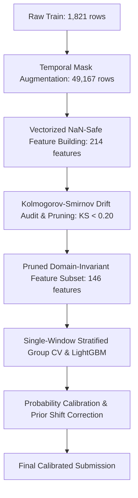

# Revised Challenge Context & Modeling Strategy

This document details the updates made to the Aquaculture Pond Detection project following the organizers' revised challenge setup.

---

## 1. The Revised Challenge Setup

### Data Changes
* **No Coordinates**: `latitude` and `longitude` metadata columns have been completely removed.
* **Dataset Rescale**:
  * **Train Set**: Expanded to **1,821 samples** (contains the original training set + the original test set with labels).
  * **Test Set**: **1,030 samples** (completely new data).
* **Temporal Masking**: Test samples are masked to simulate a real-world partial-observation setting. Each test sample only includes a consecutive block of **4, 5, or 6 months** of observations; the remaining months are set to `-9999` across all 12 bands.

---

## 2. Our Modeling Approach

To address coordinate removal and temporal missingness, we implemented a robust pipeline structured as follows:

### 2.1 NaN-Safe Feature Engineering & Trend Extraction
* All raw `-9999` masks are replaced with `NaN` at load time.
* Temporal aggregations (means, medians, standard deviations, percentiles) are calculated row-wise ignoring `NaN` values.
* **Vectorized Linear Trend Slopes (`__trend_slope`)**: Added linear slope extraction ($\Delta y / \Delta t$) across valid unmasked months for key indices (`NDWI`, `MNDWI`, `NDTI`, `re1_nir`, `SAR_diff_db`) to capture dynamic water filling/harvesting trajectories.
* All occurrence counts (like months meeting water thresholds) are normalized as fractions of observed months.

### 2.2 Temporal Mask Augmentation
* To prevent distribution shifts on statistical aggregations between 12-month training profiles and 4–6 month test profiles, the 1,821 training profiles were expanded to **49,167 samples** by simulating all 24 possible consecutive 4, 5, or 6-month observation windows.

### 2.3 Single-Window Stratified Group CV
* To prevent target leakage across augmented duplicates of the same training sample while mirroring test-time evaluation, CV splits are formed on a 1-window-per-sample subset (1,821 validation rows) grouped by original sample ID.

### 2.4 Empirical KS Drift Pruning
* Applied Kolmogorov-Smirnov (KS) two-sample testing between training and test distributions.
* Features exhibiting severe distribution drift ($\text{KS} \ge 0.20$, such as raw shifted radar backscatter levels `SAR_diff_db__mean` and raw vegetation ranges) are systematically pruned.
* Leaving **146 strictly domain-invariant features** in `invariant_features.txt`.

### 2.5 Tree Density & Model Regularization
* **Tree Observation Density Rule:** `colsample_bytree` is dynamically rescaled to maintain an optimal tree density of ~76 features per split ($\text{colsample\_bytree} = 76 / 146 = 0.5205$).
* **Scale Alignment:** Independent Quantile Transformations were disabled (`--no-quantile`) to prevent non-linear ECDF threshold warping across test windows.
* Parameters: `max_depth=6`, `num_leaves=40`, `min_child_samples=109`, `reg_alpha=0.183`, `reg_lambda=2.70`.

---

## 3. Submission History (Revised Phase)

| Submission | Configuration | OOF Score | LB Score | LB AUC | LB F1 | Predicted Ponds |
|---|---|---|---|---|---|---|
| Phase 2 Baseline | All 209 features, high capacity parameters | 0.9791 | 0.8303 | 0.8432 | 0.8217 | 634 / 1030 |
| Phase 2 Invariant | 84 robust features (pruned), high capacity | 0.9715 | 0.8316 | 0.8277 | 0.8342 | 637 / 1030 |
| Quantile Warping Bug | Independent ECDF transform on train/test | 0.9740 | 0.7981 | 0.8102 | 0.7902 | 643 / 1030 |
| **KS Pruned + Trend (Sub 34)** | **146 invariant features, no quantile, colsample=0.5205** | **0.9812** | **0.8412** | **0.8459** | **0.8380** | **648 / 1030** |

---

## 4. Next Steps for Top Ranks (Target: LB 0.924+)

1. **CatBoost & XGBoost Integration:** Train symmetric decision trees on the 146 invariant feature matrix to construct a multi-architecture ensemble.
2. **Seasonal Z-Score Pre-normalization:** Standardize monthly bands relative to annual population monthly means before computing window aggregations.
